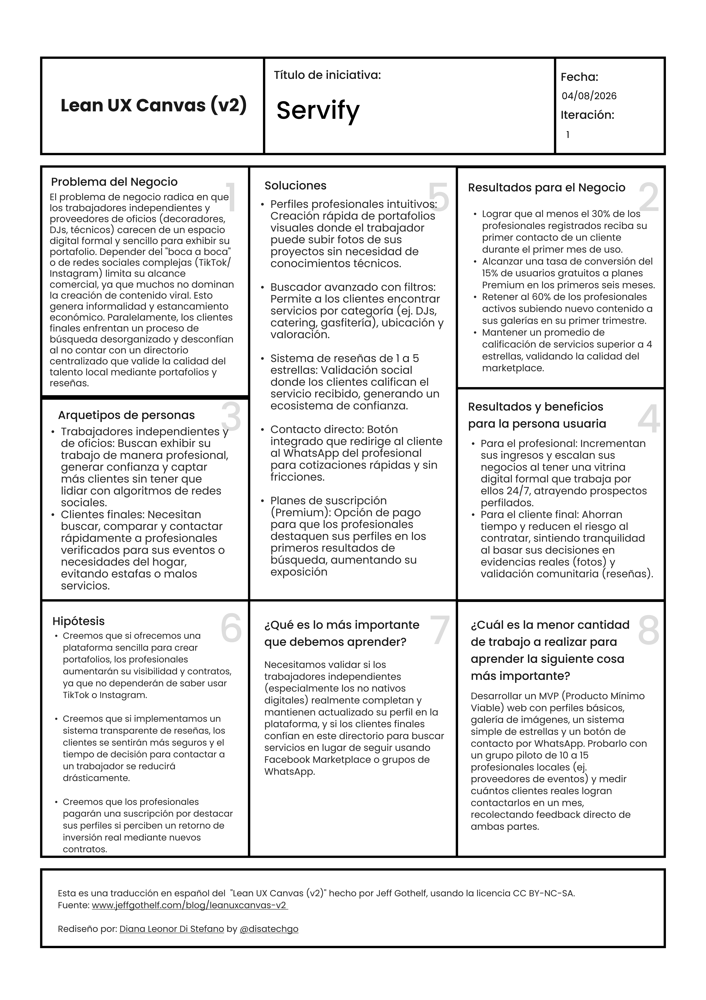

# Capítulo I: Introducción

## 1.1. Startup Profile

### 1.1.1. Descripción de la Startup

**Servify** es una startup tecnológica que desarrolla soluciones digitales enfocadas en democratizar la visibilidad online de los trabajadores independientes y emprendedores. A través de su plataforma intuitiva, la aplicación permite a los profesionales crear perfiles personalizados, exhibir galerías visuales de sus proyectos y conectar de manera directa con clientes potenciales. La herramienta digitaliza la oferta de oficios y servicios, transformando el tradicional "boca a boca" en un portafolio digital accesible y profesional para promover negocios más rentables y escalables.

La plataforma está diseñada para atender necesidades específicas de diversos perfiles de usuario. Por un lado, ofrece a los **proveedores de eventos** (decoradores, DJs, servicios de catering, animadores) un espacio especializado para mostrar la calidad de su trabajo sin depender de la complejidad o los algoritmos de las redes sociales; por otro lado, permite a los **trabajadores de oficios técnicos y manuales** (carpinteros, gasfiteros, reposteros) tener una presencia digital formal y confiable. Asimismo, brinda a los **clientes finales** una alternativa segura y centralizada para buscar, comparar mediante reseñas y contactar al talento local adecuado para sus necesidades puntuales.

Con un firme compromiso con la inclusión digital y el empoderamiento económico, **Servify** busca liderar la transformación tecnológica del sector de oficios independientes en el Perú. Al combinar una interfaz amigable orientada a usuarios no nativos digitales con un robusto sistema de perfiles, la startup no solo ayuda a incrementar las oportunidades laborales del talento local, sino que también fomenta una comunidad basada en la transparencia y la confianza profesional, asegurando que cada servicio brindado fortalezca la reputación del trabajador.

**Misión:** Impulsar el crecimiento económico y la formalización digital de los trabajadores independientes mediante soluciones tecnológicas accesibles que aumenten su visibilidad, optimicen la exhibición de su trabajo y faciliten conexiones seguras y directas con clientes que requieran sus servicios.

**Visión:** Ser el marketplace y directorio de oficios de referencia en el Perú y Latinoamérica, liderando la creación de un ecosistema digital inclusivo donde el talento local y las necesidades de los usuarios converjan para generar oportunidades de trabajo justas, transparentes y de alta calidad.

### 1.1.2. Perfiles de integrantes del equipo

Al ser un proyecto de portafolio personal, el desarrollo y arquitectura de la plataforma están a cargo de un único creador que asume todos los roles del ciclo de vida del software.

| Perfil | Datos del Desarrollador | Conocimientos y Habilidades |
| :---: | :--- | :--- |
|  **Full-Stack Developer** | **Nombres y Apellidos:** Angelo Stephano Moscoso Bejar | **Stack Tecnológico:** C++, CSS, HTML, Vue.js, SQL, JS.  **Aportes al Proyecto:** Encargado del diseño de la arquitectura de datos, desarrollo frontend/backend, maquetación de interfaces responsivas y la implementación de la lógica de negocio. |

## 1.2. Solution Profile

### 1.2.1. Antecedentes y problemática

### Antecedentes

En el mercado laboral actual, la presencia en internet se ha vuelto un factor indispensable para la captación de clientes. Sin embargo, un gran porcentaje de trabajadores independientes, técnicos y profesionales de oficios en el Perú opera en la informalidad digital. A pesar de contar con talento empírico y amplia experiencia, la falta de una plataforma formal, intuitiva y accesible limita su crecimiento comercial, dejándolos en desventaja competitiva frente a agencias o empresas establecidas que sí cuentan con los recursos para mantener sitios web corporativos.

Un caso crítico se observa en el rubro de la organización de eventos privados, como celebraciones de 15 años, bodas o fiestas infantiles. Proveedores de servicios como decoradores, personal de catering, animadores o DJs se ven obligados a depender casi exclusivamente de las recomendaciones tradicionales (el "boca a boca"). Hoy en día se utilizan mucho redes sociales como **TikTok o Instagram** para intentar ganar visibilidad; sin embargo, manejar estas plataformas resulta ser un desafío mayor. Lidiar con los algoritmos, las tendencias y la necesidad de generar contenido viral constante es algo que la gran mayoría de estos trabajadores no logra dominar. Ellos necesitan una herramienta mucho más sencilla y directa que no exija ser un experto creador de contenido, permitiéndoles enfocarse en la ejecución práctica de su verdadero oficio.

Actualmente, la búsqueda y exhibición de estos trabajos es desorganizada. Los profesionales suelen utilizar plataformas genéricas como Facebook Marketplace o se ven en la necesidad de enviar fotografías sueltas por WhatsApp cuando un prospecto solicita ver su portafolio. No existe un ecosistema centralizado donde un decorador, un carpintero o un repostero puedan estructurar un catálogo profesional verificable. La falta de esta herramienta genera un vacío tecnológico que Servify busca llenar, transformando la exhibición informal en un directorio estructurado que conecte el talento local con los clientes de forma directa, profesional y segura, con una curva de aprendizaje mínima.

### Problemática

Para entender a profundidad la necesidad que impulsa este proyecto, se aplicó la técnica de análisis de las 5W's + 2H's:

### 5W's
### What (¿Cuál es el problema?):
Los trabajadores independientes y proveedores de oficios carecen de un espacio digital especializado e intuitivo para mostrar su portafolio de manera profesional. Esto limita severamente su alcance comercial y crecimiento, mientras que los clientes finales enfrentan dificultades y desconfianza al intentar encontrar talento local verificado sin tener que navegar por redes sociales genéricas y desorganizadas.

### When (¿Cuándo ocurre el problema?):
El problema se evidencia de manera constante, pero se agudiza cuando el profesional intenta conseguir nuevos clientes fuera de su círculo inmediato de referidos, o cuando un cliente necesita organizar un evento (o solucionar un requerimiento técnico) y no cuenta con contactos directos de confianza para realizar el trabajo.

### Where (¿Dónde ocurre el problema?):
En el mercado local de servicios independientes, oficios técnicos y organización de eventos a nivel nacional (Perú), donde la transición hacia la formalización digital aún es deficiente y la oferta de servicios se encuentra dispersa en internet.

### Who (¿A quién o quiénes afecta el problema?):
- **Trabajadores independientes y de oficios:** Decoradores, proveedores de catering, DJs, reposteros, carpinteros y técnicos que pierden oportunidades de contrato por falta de visibilidad online y no dominan la creación de contenido para redes sociales.
- **Clientes finales:** Personas y familias que gastan tiempo valioso buscando profesionales confiables y tienen dificultades para verificar la calidad del trabajo antes de contratar.
- **El desarrollo económico local:** Debido al estancamiento de pequeños emprendedores que no logran escalar sus negocios por la brecha digital.

### Why (¿Por qué sucede el problema?):
Porque desarrollar y mantener una página web propia resulta costoso y técnicamente complejo. Simultáneamente, aunque plataformas como **TikTok e Instagram** están en pleno auge, su manejo exige estrategias de edición, publicación y gestión de comunidades que estos profesionales empíricos no dominan. Ellos necesitan una solución mucho más sencilla y directa para exhibirse. Además, las plataformas de compraventa existentes carecen de filtros diseñados para validar el profesionalismo de los servicios ofrecidos.

### 2H's
### How (¿Cómo aparece el problema?):
El problema se manifiesta a través del estancamiento en la cartera de clientes del trabajador. Constantemente se ven en la necesidad de recurrir a métodos informales, enviando fotos desordenadas por mensajería cuando un potencial cliente pide "ver sus trabajos". Del lado del cliente, este proceso informal genera fricción, se percibe como poco profesional y prolonga innecesariamente la decisión de contratación.

### How Much (¿Cuánto afecta el problema?):
El impacto económico se traduce en una pérdida significativa de contratos potenciales, lo que reduce drásticamente los ingresos mensuales de los emprendedores locales y frena su escalabilidad. Para el cliente, representa un alto costo de oportunidad reflejado en horas invertidas en búsquedas ineficientes y el riesgo financiero de contratar servicios de baja calidad por no contar con un portafolio validado que respalde al trabajador.

### 1.2.2. Lean UX Process

#### 1.2.2.1. Lean UX Problem Statements

El estado actual de la exhibición de portafolios para trabajadores independientes (proveedores de eventos y oficios) depende del "boca a boca", envío de fotos desordenadas por WhatsApp o del uso de redes sociales complejas (como TikTok o Instagram) que no dominan. Lo que los profesionales necesitan es una forma sencilla y directa de centralizar su trabajo en un perfil profesional sin tener que lidiar con algoritmos ni creación de contenido viral. Hemos observado que la falta de una presencia digital formal limita su crecimiento y les hace perder oportunidades de contrato.

**¿Cómo podríamos diseñar una plataforma accesible que permita a los trabajadores independientes exhibir su portafolio profesionalmente y captar más clientes con una curva de aprendizaje mínima?**

El estado actual de la búsqueda de talento local (decoradores, DJs, técnicos) obliga a los clientes finales a recurrir a plataformas genéricas como Facebook Marketplace o a depender de recomendaciones limitadas de su círculo cercano. Lo que los clientes necesitan es visibilidad sobre la calidad real del trabajo y reseñas confiables para tomar decisiones seguras. Hemos observado que esta fricción genera desconfianza, pérdida de tiempo y el riesgo constante de contratar servicios de baja calidad.

**¿Cómo podríamos ofrecer a los clientes finales un directorio centralizado y confiable que les permita buscar, comparar y contactar rápidamente a profesionales verificados para sus eventos o necesidades del hogar?**

#### 1.2.2.2. Lean UX Assumptions

**Assumptions Worksheet**

- **¿Quién es el usuario?**
  Tenemos dos tipos de usuarios principales: los profesionales de oficios (decoradores, DJs, proveedores de catering, carpinteros, técnicos, etc. que buscan clientes) y los clientes finales (personas o familias que necesitan organizar un evento o solucionar un requerimiento doméstico).

- **¿Dónde encaja nuestro producto en su trabajo o vida?**
  Para el profesional, Servify se integrará como su herramienta principal de ventas y carta de presentación digital. Para el cliente final, funcionará como el directorio de confianza "on-demand" al que acudirán desde su smartphone o computadora cada vez que necesiten cotizar y contratar un servicio específico.

- **¿Qué problemas resuelve nuestro producto?**
  El producto resuelve la informalidad digital del trabajador independiente, la brecha tecnológica que les impide usar redes sociales como canal de ventas eficiente, y la desconfianza/frustración del cliente al buscar talento local verificado.

- **¿Cuándo y cómo es usado nuestro producto?**
  El profesional lo usará para crear/actualizar su galería de trabajos, recibir solicitudes y gestionar contactos. El cliente final lo usará esporádicamente para realizar búsquedas mediante filtros (categoría, ubicación), leer reseñas y presionar un botón de contacto directo.

- **¿Qué características son importantes?**
  Para el segmento de profesionales: creación de perfiles intuitiva, carga rápida de galerías visuales y botón de contacto directo (ej. WhatsApp). Para el segmento de clientes: motor de búsqueda con filtros, sistema de reseñas de 1 a 5 estrellas y validación visual de los proyectos realizados.

- **¿Cómo debe verse nuestro producto y cómo comportarse?**
  Nuestro producto debe transmitir profesionalismo, seguridad y confianza. Su interfaz debe ser extremadamente limpia, visual e intuitiva, asegurando que un profesional no nativo digital pueda configurar su perfil sin fricciones ni confusiones técnicas.

**Business Assumptions:**

- Creemos que los profesionales independientes están dispuestos a pagar una suscripción (mensual o anual) por un perfil "Premium" destacado, siempre que la plataforma les genere un retorno de inversión mediante la captación de nuevos clientes.
- Estas necesidades se pueden resolver mediante un modelo de "Marketplace de Servicios" o directorio digital con un enfoque inicial *freemium* para construir rápidamente una base masiva de proveedores.
- Creemos que los clientes finales prefieren navegar por una plataforma especializada con reseñas y portafolios organizados antes que contactar a desconocidos a través de redes sociales genéricas.
- Nuestro mayor riesgo es el "problema del huevo y la gallina": que los clientes no encuentren suficientes opciones en la plataforma en su etapa inicial, o que los profesionales abandonen sus perfiles si no reciben contactos rápidos.
- Creemos que las alianzas estratégicas con gremios locales, asociaciones de eventos o proveedores mayoristas pueden acelerar la adopción masiva de la plataforma por parte de los trabajadores.

#### 1.2.2.3. Lean UX Hypothesis Statements

- Creemos que si ofrecemos a los trabajadores independientes y proveedores de eventos una plataforma simplificada para crear portafolios profesionales sin requerir conocimientos avanzados en redes sociales, entonces aumentarán su visibilidad online y lograrán captar más clientes. Sabremos que estamos en lo correcto cuando al menos el 30% de los profesionales registrados reciba su primera solicitud de cotización o contacto directo a través de la plataforma durante su primer mes de uso.

- Creemos que si brindamos a los clientes finales un directorio centralizado con galerías visuales y un sistema de reseñas de 1 a 5 estrellas, entonces sentirán mayor seguridad y reducirán el tiempo invertido en buscar talento local confiable. Sabremos que estamos en lo correcto cuando las analíticas muestren que los usuarios completan el flujo desde la búsqueda hasta hacer clic en "Contactar" en menos de 5 minutos, y cuando los servicios contratados mantengan un promedio de calificación superior a 4 estrellas.

- Creemos que si proporcionamos a los profesionales de oficios la opción de adquirir planes de suscripción "Premium" para destacar sus perfiles en los primeros resultados de búsqueda, entonces adoptarán el modelo de pago al percibir un retorno de inversión real. Sabremos que estamos en lo correcto cuando logremos una tasa de conversión de al menos el 15% de usuarios gratuitos a planes de pago dentro de los primeros seis meses de lanzamiento.

#### 1.2.2.4. Lean UX Canvas

  

## 1.3. Segmentos Objetivo

| | Segmento 1: Trabajadores independientes y de oficios | Segmento 2: Clientes finales (Organizadores y hogares) |
| :--- | :--- | :--- |
| **Variables** | Profesionales empíricos, técnicos y proveedores de servicios (decoradores, DJs, catering, mantenimiento). | Personas y familias que requieren contratar servicios para eventos privados o necesidades del hogar. |
| **Geográfica** | Ubicados principalmente en zonas urbanas y suburbanas del Perú (con foco inicial en Lima Metropolitana), donde existe una alta demanda constante de eventos y reparaciones. | Ubicados en zonas urbanas y suburbanas, en distritos con actividad social, familiar y demanda de servicios a domicilio. |
| **Demográfica** | **Edad:** 20-55 años. **Género:** Mixto. **Educación:** Empírica, técnica o superior. **Ingresos:** Variables (dependientes del flujo de contratos). **Ocupación:** Emprendedores de oficios. | **Edad:** 25-55 años. **Género:** Mixto. **Educación:** Secundaria completa o superior. **Ingresos:** Medio a alto. **Estado civil:** Padres de familia, parejas a punto de casarse, solteros independientes. |
| **Psicológica** | Buscan crecimiento económico, formalidad y reconocimiento por su trabajo. Se sienten abrumados por la complejidad de crear contenido viral para redes sociales. Valoran la simplicidad y las herramientas directas que les ahorren tiempo en ventas. | Valoran la confianza, la seguridad y la practicidad. Buscan reducir el riesgo de ser estafados o recibir un mal servicio. Prefieren tomar decisiones racionales basadas en validación visual (fotos/portafolios) y social (reseñas). |
| **Función de comportamiento** | Uso básico o intermedio de smartphones (WhatsApp, Facebook). Adoptan tecnología solo si la curva de aprendizaje es mínima. Se frustran al perder clientes por no tener un catálogo ordenado. Su objetivo principal es cerrar más contratos rápidamente. | Uso frecuente de internet y aplicaciones para resolver necesidades. Se frustran al perder tiempo buscando en grupos desorganizados de Facebook o esperando que les envíen fotos sueltas. Su objetivo es encontrar al proveedor ideal de forma rápida y segura. |

  

  
<strong>Proyecto Personal de Portafolio</strong> 
  Desarrollo de Aplicaciones Web y Arquitectura de Software

   

  <h3><strong>Informe Técnico de Producto</strong></h3>

   

  
Producto Digital 
  <strong>Servify Web Platform</strong>

    

  
<strong>Desarrollador / Team Leader</strong>

<table style="margin: 0 auto; border-collapse: collapse;">
  <tr>
    <th style="text-align:left; padding: 5px 20px;">Rol</th>
    <th style="text-align:left; padding: 5px 20px;">Apellidos y Nombres</th>
    <th style="text-align:left; padding: 5px 20px;">GitHub</th>
  </tr>
  <tr>
    <td style="padding: 5px 20px;">Full-Stack Developer</td>
    <td style="padding: 5px 20px;">Stephano Moscoso Bejar</td>
    <td style="padding: 5px 20px;"><a href="https://github.com/StephanoDang">@StephanoDang</a></td>
  </tr>
</table>

  

<strong>Lima, Perú</strong>

<strong>Julio 2026</strong>

---

## Registro de Versiones del Informe

| Versión | Fecha | Autor | Descripción de Modificación |
|---------|-------|-------|-----------------------------|
| 1.0 | 30/07/2026 | Stephano Dang | Creación inicial del documento. Definición del Startup Profile (Misión, Visión y Descripción). |

---

## Contenido

* [Capítulo I: Introducción](#capítulo-i-introducción)
    * [1.1. Startup Profile](#11-startup-profile)
        * [1.1.1. Descripción de la Startup](#111-descripción-de-la-startup)
        * [1.1.2. Perfiles de integrantes del equipo](#112-perfiles-de-integrantes-del-equipo)
    * [1.2. Solution Profile](#12-solution-profile)
        * [1.2.1. Antecedentes y problemática](#121-antecedentes-y-problemática)
        * [1.2.2. Lean UX Process](#122-lean-ux-process)
    * [1.3. Segmentos Objetivo](#13-segmentos-objetivo)
* [Capítulo II: Requirements Elicitation & Analysis](#capítulo-ii-requirements-elicitation--analysis)
* [Capítulo III: Requirements Specification](#capítulo-iii-requirements-specification)
* [Capítulo IV: Product Design](#capítulo-iv-product-design)
* [Capítulo V: Product Implementation, Validation & Deployment](#capítulo-v-product-implementation-validation--deployment)

---
